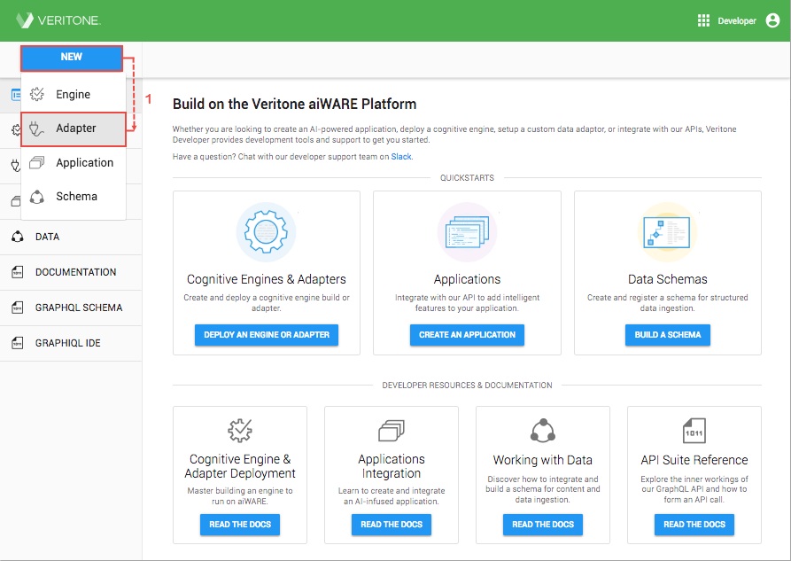
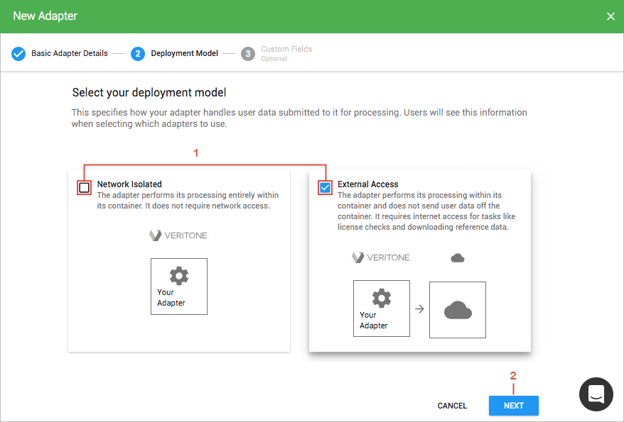
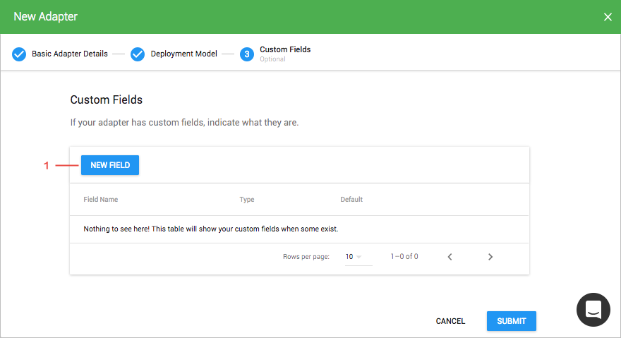
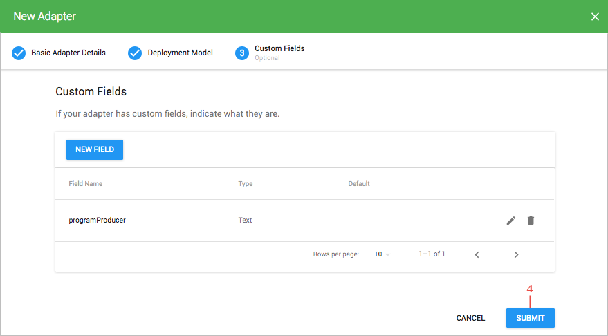
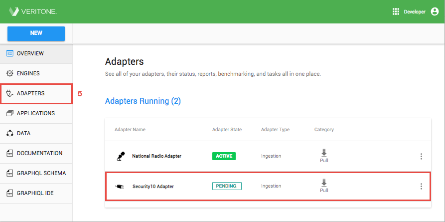
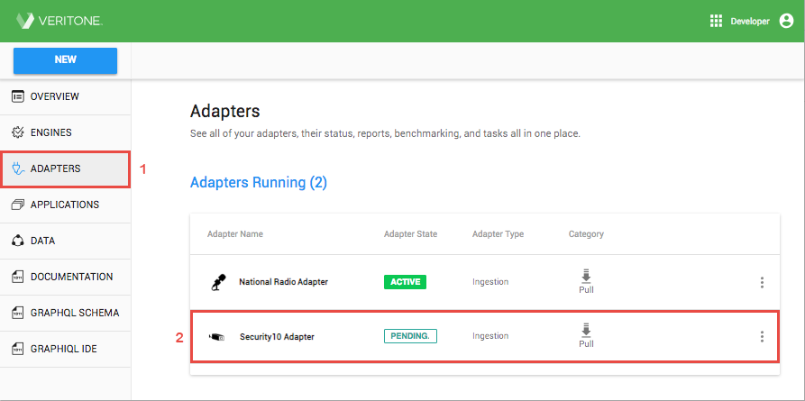
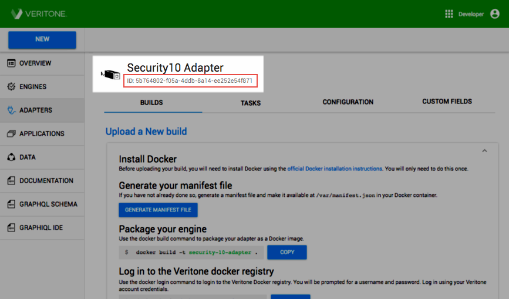

<!-- markdownlint-disable no-inline-html -->

# Step 1 - Register Your Adapter

Building an adapter in Veritone begins with a few basic steps to configure and register it. You'll use the Adapter Registration Wizard to enter general details about your technology, give scope to its capabilities, and specify the properties it will support.

The Adapter Registration Wizard launches from the Veritone Developer homepage. It walks you through the pages and prompts you to enter specific information about your adapter, including connection and interaction properties, runtime implementation details, and design elements to uniquely identify it in the Veritone UI.

The wizard includes three pages:

* **Basic Adapter Details:** The adapter name, category, description, icon, and logo
* **Deployment Model:** Host environment type where your adapter will run
* **Custom Fields:** Additional properties used by your adapter to collect data (optional)

The steps for completing the wizard are described in detail below. When finished, your registered adapter will be listed on your account’s *Adapters* dashboard where you can upload builds to it, edit the configuration settings, and more.

## 1. Enter Basic Adapter Details

Provide basic details about your adapter.

| Enter Engine Details   |    |
| ---------------------- | -- |
| 1. Log into [Veritone Developer](https://developer.veritone.com). Click **New** in the upper left of the window and select **Adapters** from the dropdown. The _Basic Adapter Details_ page opens. | 

 |
| 2. **Adapter Name**: _(required)_ Enter the name of your adapter as you would like it to appear to users.   3. **Adapter Category**: _(required)_ Select the category from the drop-down that describes your adapter's operation type.   4. **Adapter Description**: _(required)_ Briefly describe the adapter's purpose and function. This description displays to users on the new ingestion job configuration page.   5. **Icon**: _(optional)_ Upload an icon for your adapter from your local file system as a 128x128 PNG or JPG file. The image displays with your adapter's name on the new ingestion job configuration page.   6. **Logo**: _(required)_ Upload a logo image for your engine from your local file system as a 500x250 PNG or JPG file. The logo is used to identify your engine on the _Select Adapter_ page of Veritone CMS. It's important to note that the logo is the only identifier users will see &mdash; your adapter's name will not display. To ensure your adapter is easily identified, it's recommended to incorporate the adapter name into your logo image.   7. Click **Next** to continue. The _Select your deployment model_ window opens. | 

  |

## 2. Choose a Deployment Model

The deployment model indicates what type of network access your adapter requires to run. Veritone supports two deployment models that describe how and where your adapter will be made available to users. Selecting the best model depends on your business needs — the environment should promote availability and connectivity while providing maximum security, performance, and scalability.

* **Network Isolated**: The engine is fully isolated and runs solely within Veritone's infrastructure. It does not require network access.
* **External Access**: The engine performs processing within its container and does not send user data off the container. It requires internet access for tasks such as license checks and database updates.

Once your adapter is registered, the deployment model cannot be changed. The deployment model is applied to an adapter build at the time of upload. If your adapters will have multiple builds, the same deployment model will be applied to each build. To change the deployment model or to assign more than one deployment model to your adapter, simply register a separate adapter and select the alternate deployment model during setup.

It's important to choose the deployment model best suited to the needs of your adapter. When a build is uploaded, testing is performed to ensure that the build operates in accordance with the designated deployment model. If any discrepancies are detected, the build will not pass the testing. (e.g., A build with a network isolated deployment model that makes calls out to an external API will not pass.)

_Additional Notes About Deployment Models:_

* Engines that are exclusively public may have limited usage opportunities due to unsecured API.
* While many Veritone clients prefer to use our cloud-based software deployment, others require a network-isolated instance of the Veritone Platform due to regulation or security requirements.

| **Choose Deployment Model** |     |
|--------------------------------- | --- |
| 1. Click the checkbox on a **deployment model option** to select it. The selected model's checkbox is enabled.    2. Click **Next**. The _Custom Fields_ page opens. | 

 |

## 3. Add Custom Fields (optional)

The data that’s collected from an external source is defined by the schema of the Source Type specified in your manifest file. Depending on the external source that your adapter connects to, the list of fields provided in the schema may not fully support your needs. *Custom Fields* allows you define special parameters not included in the Source Type schema to retrieve additional types of data from the external source. These fields will be available for users to select when creating a new ingestion job in Veritone CMS.

Custom Fields are optional and can be added in the Registration Wizard when setting up your adapter or through the *Configuration* tab in the adapter settings after registration complete. To skip this step and complete the Adapter Registration Wizard, click **Submit** at the bottom of the window.

| **Custom Fields** |     |
|--------------------------------- | --- |
| 1. Click **New Field**. The _Add Field_ modal opens. | 

 |
| 2. Enter information for each of the properties to define your field. Properties with an `*` are required.    a. **Field Name** Enter the name of your field. The field name is used as the `key` of the parameter inside of the `taskPayload` given to your adapter at runtime.    b. **Field Label** Enter a user-friendly name for your field. The Field Label displays to users when creating a new ingestion job in Veritone CMS.     c. **Field Info** Briefly describe the purpose of the field. The Field Info displays to end users in Veritone CMS.     d. **Field Type** Choose the type of input the parameter accepts.   <li> _Text:_  Standard text input  </li><li> _Number:_ Standard number input with optional min/max/step restrictions  </li><li> _Picklist:_ A list of KVP options where only a single value is accepted  </li><li> _MultiPicklist:_ A list of KVP options where multiple options can be selected    3. Click **Add Field** to save your entry and create the custom field. The _Add Field_ modal closes and the new Custom Field displays in the table. | 

 |
| 4. Repeat the previous steps to create additional Custom Fields, if necessary. When all Custom Fields are created, click **Submit**. The Adapter Registration Wizard closes and the _Upload a New Build_ page opens. | 

 |
| 5. The registration process is complete. Click **Adapters** on the left menu to view and your new adapter on the _Adapters_ dashboard.  | 

 |

## Adapter States

Veritone Developer uses *Adapter States* to capture the most relevant aspects of an adapter's lifecycle and operations and to help you easily identify and track your adapter's progression through the development workflow.

There are four available states for adapters, three of which apply to workflow stages. Workflow-related states are automatically set by the system and transition from one to the next when certain functions are carried out. Upon registration, an adapter enters the *Pending* state. It progresses to *Ready* when a build is approved, and it becomes *Active* when it's live in the Veritone platform. The final non-workflow state allows you to manually *Disable* an adapter and stop it from processing new tasks.

The table below provides additional information about each of the *Adapter States*, including details about transitions and optional actions that can be performed.

| **Adapter State** | **Description**                                                                                                                                                                                                                                            | **Available Actions**                  |
| --------------- | ---------------------------------------------------------------------------------------------------------------------------------------------------------------------------------------------------------------------------------------------------------- | -------------------------------------- |
| **Pending**     | The _Pending_ state is system-triggered and takes effect when the adapter has been created but it does not have any _Approved_ builds.                                                                                                                                                                                                          | Edit, Disable, Delete |
| **Ready**       | The _Ready_ state is system-triggered and takes effect when an adapter has at least one approved build, but no builds that are deployed.                                                                                                                                                                                                        | Edit, Disable, Delete |
| **Active**      | The _Active_ state is system-triggered and takes effect when a build is deployed.                                                                                                                                                                                                                                                              | Edit, Disable, Delete |
| **Disabled**    | The _Disabled_ state is user-enabled. Disabling an adapter prevents it from running and processing new tasks. Any tasks that are in progress when the adapter is disabled will finish processing. In addition, when a build is *Disabled,* the _Deploy_ option will be removed from any _Approved_ builds. An adapter can only be set to _Disabled_ from the _Ready_ or _Active_ states. | Enable |

## Find Your Adapter ID

Upon completion of the registration process your adapter was assigned a unique ID number. You'll use this ID to identify your adapter in various places throughout the development process, so it's important to know where to find it.

|**Locate an Adapter ID**|   |
|--------------------------|---|
|1. Click **Adapters** on the left menu of the Veritone Developer homepage. The _Adapters_ dashboard opens.   2. Click the adapter name in the list. The adapter details page opens to the _Builds_ tab. |

|
|The _Adapter ID_ is located under the adapter name near the top of the window. |

|
