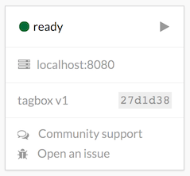

# Machine Box API guidelines

Machine Box APIs are standard RESTful JSON/HTTP endpoints, making them very easy
for developers of all levels.

## Box specific APIs

Each box ships with its own unique API tailored to the specific needs of particular problems. To access the documentation, you need to spin up the box on your local development machine and visit the Interactive console that is served from inside the box.

For a real example, follow the [Facebox tutorial](/developer/machine-box/boxes/teaching-facebox).

## Basic Authentication

If the boxes are going to be publicly accessible, it is recommended that you protect them by providing a username and password, which must be included in every request to the box.

You do this by spinning up the box with the following additional environment variables:

```bash
docker run -e "MB_BASICAUTH_USER=username" -e "MB_BASICAUTH_PASS=password" ...
```

All requests to the box must now include the Basic Authentication HTTP header, otherwise they will
receive a `401 Unauthorized` response.

```plain
Authorization: Basic base64EncodedString
```

* `base64EncodedString` - (string) The username and password base64 encoded as per the [Basic access authentication specification](https://en.wikipedia.org/wiki/Basic_access_authentication) following the format: `username:password`
* Most HTTP clients provide a way to set these credentials without having to worry about encoding
* Encoding the credentials into the URL is deprecated and therefore *not* supported

## `/info` endpoint



All boxes provide the `/info` endpoint which returns some basic details about
the box:

```json
GET /info
{
  "success": true,
  "name":    "tagbox",
  "version": 1,
  "build":   "27d1d38",
  "status":  "ready",
  "plan": "pro"
}
```

* `success` - (boolean) Whether the `/info` request was successful or not
* `name` - (string) The name of the box
* `version` - (number) The version of the box
* `build` - (string) The code that describes the exact build of the box (useful when reporting issues)
* `status` - (string) The status of the box
* `plan` - (string) The subscription plan (influences which features are available and any limits that might apply)

### Box status

Valid box status values include:

* `starting...` - The box is starting up and will be ready shortly
* `ready` - The box is ready to receive API calls (wait for this before making requests)
* `shutting down` - The box is shutting down and will be unavailable soon

Once a box has shut down, the `/info` endpoint stops working, at this point the Interactive consoles will show `unavailable`.

## `success` and error handling

All Machine Box APIs return a single JSON object that have a `success` field, and may have an `error` field, allowing you to write failure logic once, and reuse it.

For a successful response, you will get:

```json
{
  "success": true,
  // some other data
}
```

If something goes wrong, `success` will be `false` and the `error` field will be provided explaining what happened:

```json
{
  "success": false,
  "error": "url must be absolute"
}
```

## Submitting files

If a box endpoint requires a file, you have three main ways of submitting one:

* POST the file directly (like uploading from an HTML form)
* Submit an absolute URL to a file, which will be downloaded and processed
* Encode the file with Base 64 encoding and POST the string

The Interactive console for each box provides more details on how to do this in each case.

## Health endpoints

All Machine Box boxes support various health endpoints to assist with deployment and operations.

### `/healthz` endpoint

```json
GET /healthz
```

Boxes will reply with a JSON payload indicating the health of the box:

```json
{
  "success": true,
  "hostname": "83b1a33ef322",
  "metadata": {
    "boxname": "facebox",
    "build": "18f2361"
  },
  "errors": [{
    "error": "Something went wrong",
    "description": "Something went wrong"
  }]
}
```

* `hostname` - The host of the box
* `metadata.boxname` - The name of the box
* `metadata.build` - The build tag of the box
* `errors` - An array of any errors indicating bad health
* `errors[].error` - An error string indicating a problem
* `errors[].description` - A description of what went wrong

### `/liveness` endpoint

The `/liveness` endpoint can be used to check that the box is alive, and responding.

It replies with a very simple `200 OK` response.

### `/readyz` endpoint

```json
GET /readyz
```

Boxes will reply with `503 Service Unavailable` if the box status is not `ready`,
otherwise a `200 OK` response will be sent.

## Common data types

All Machine Box APIs use various data types to describe data. This section highlights some interesting
types and how best to use them.

### Duration

 A duration string is a possibly signed sequence of decimal numbers, each with optional fraction and a unit suffix, such as `30m`, `1.5h` or `2h45m`. Valid time units are `ns`, `us` (or `µs`), `ms`, `s`, `m`, `h`.

Examples:

* `10m` - Ten minutes
* `2h` - Two hours
* `2h30m` or `2.5h` - Two and a half hours
* `24h` - One day
* `168h` - One week
