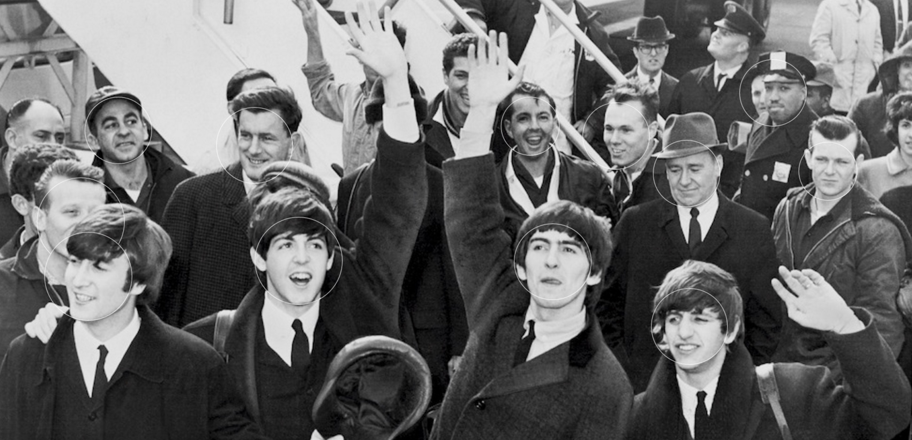

# Facebox

Facebox detects and identifies faces in photos. You can teach facebox with as little as one sample image.

* BLOG: [Stream and recognise people from a webcam with Go](https://blog.machinebox.io/streaming-and-recognize-people-from-a-webcam-with-go-and-facebox-acea645b94ab)
* BLOG: [face-verify.js: Monitoring who is physically looking at a website for additional security](https://blog.machinebox.io/face-verify-js-monitoring-who-is-looking-at-a-website-for-additional-security-1d6025a8fedd)

## Uses for Facebox

This capability has a variety of utilities:

* Identify who is in an image
* Improve search and SEO by automatically including the names of people featured in photographs
* Drive social engagement by notifying users when they appear in new content
* Anonymize images by blurring faces
* Kick-start manual moderation of images by detecting faces ahead of time

To learn more about what you can do with Facebox, visit the [Machine Box blog](https://blog.machinebox.io/tagged/facial-recognition).

## Get started

The best way to get started with Facebox is to use it. We've put together a tutorial that
walks you through [teaching and recognizing faces](/developer/machine-box/boxes/teaching-facebox.md).

## Example experience

Facebox makes it very easy to build rich experiences using just JavaScript and CSS:

In the above image, which a real tool available when you run facebox, the rectangles returned from the API are used to draw circles around each face allowing the user to interact with them. [Learn more about how we did this](/developer/machine-box/boxes/facebox/rectangle?id=rendering-the-face-with-css).

## Interactive console

When you run Facebox, you'll have access to an interactive administration console that includes
everything you need to get going; API documentation, working code examples, interactive components, and more.

